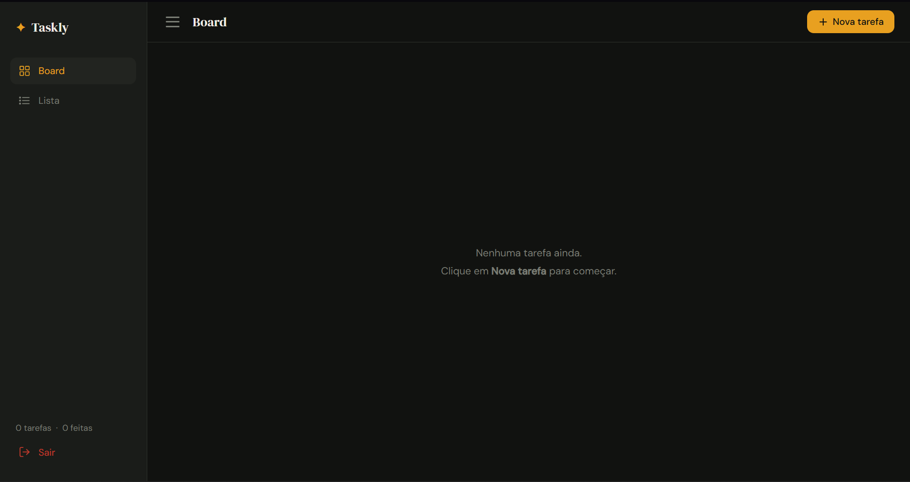
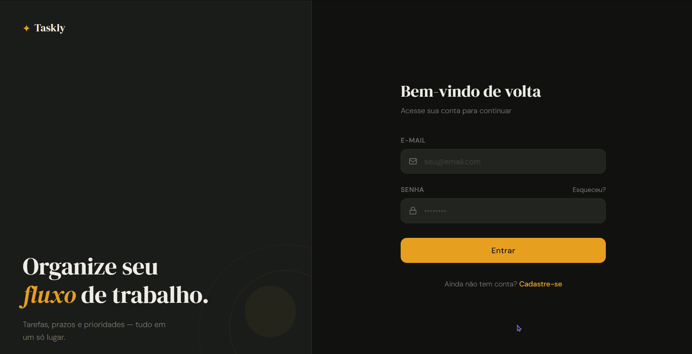
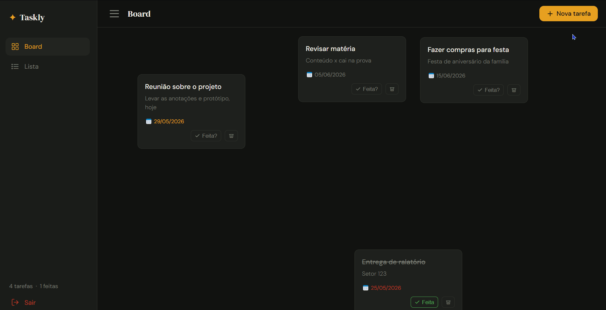

# Taskly — Gerenciador de Tarefas

> Aplicação fullstack de organização de tarefas com board interativo, lista filtrável e autenticação de usuários.


---

## Screenshots

> Tela de login com animação de slide para o cadastro


> Board com cards arrastáveis e indicação visual de prazos



> Fazendo login



> Criando tarefa



---

## Sobre o projeto

O Taskly é uma aplicação fullstack desenvolvida como projeto de portfólio com o objetivo de praticar a integração completa entre frontend, backend e banco de dados — sem frameworks front-end como React ou Vue, usando apenas HTML, CSS e JavaScript puro.

O usuário pode se cadastrar, fazer login, criar tarefas com título, descrição e prazo, organizá-las livremente em um board arrastável e acompanhá-las em uma lista com filtros. Todas as ações persistem no banco de dados em tempo real.

---

## Conceitos aplicados

- **Arquitetura REST** — API com rotas organizadas por recurso e verbos HTTP semânticos (GET, POST, PATCH, DELETE)
- **CRUD completo** — criação, leitura, atualização e remoção de tarefas e usuários
- **Autenticação** — cadastro e login com hash de senha via bcrypt, sem armazenar senha em texto puro
- **Persistência de estado** — posição dos cards no board salva no banco a cada movimento
- **Validação de dados** — schemas com Pydantic garantindo tipos e campos obrigatórios antes de chegar ao banco
- **Tratamento de erros** — try/except com rollback em todas as operações de banco, e verificação de status HTTP no frontend
- **Variáveis de ambiente** — credenciais protegidas via `.env` com python-dotenv, nunca expostas no repositório
- **Separação de responsabilidades** — projeto dividido em camadas: rotas (main.py), lógica de banco (crud.py), validação (schemas.py) e segurança (security.py)
- **Requisições assíncronas** — uso de async/await e Fetch API no frontend para comunicação com a API sem recarregar a página
- **Manipulação de DOM** — criação e remoção dinâmica de elementos, eventos de drag & drop implementados do zero
- **CSS avançado** — variáveis CSS, animações com keyframes, transições, layout com flexbox e posicionamento absoluto para efeito de slide
- **Proteção de rota** — redirecionamento para login caso o usuário acesse o dashboard sem autenticação

---

## Funcionalidades

- Cadastro e login com senha criptografada
- Tela de login com animação de slide para o formulário de cadastro
- Board com cards arrastáveis — posição preservada entre sessões
- Criação de tarefas com título, descrição e data de entrega
- Indicação visual de tarefas atrasadas (vermelho) e com prazo hoje (âmbar)
- Marcar tarefas como concluídas
- Apagar tarefas
- Aba de Lista com filtros por status e prazo
- Busca por título em tempo real
- Sidebar retrátil com contador de tarefas e feitas
- Logout com limpeza de sessão

---

## Tecnologias

### Backend
| Tecnologia | Uso |
|---|---|
| Python 3.11+ | Linguagem principal |
| FastAPI | Framework da API REST |
| psycopg2 | Conexão com PostgreSQL |
| bcrypt | Hash e verificação de senhas |
| python-dotenv | Variáveis de ambiente |
| Uvicorn | Servidor ASGI |

### Frontend
| Tecnologia | Uso |
|---|---|
| HTML5 | Estrutura das páginas |
| CSS3 | Estilização e animações |
| JavaScript puro | Lógica, drag & drop e integração com a API |

### Banco de dados
| Tecnologia | Uso |
|---|---|
| PostgreSQL | Banco relacional |

---

## Estrutura do projeto

```
taskly/
├── backend/
│   ├── main.py          # Rotas da API
│   ├── crud.py          # Operações no banco de dados
│   ├── schemas.py       # Validação de dados (Pydantic)
│   ├── security.py      # Hash e verificação de senha
│   ├── database.py      # Conexão com o PostgreSQL
│   ├── init_db.py       # Script de criação das tabelas
│   ├── .env.example     # Modelo de variáveis de ambiente
│   └── requirements.txt
│
├── frontend/
│   ├── login.html
│   ├── dashboard.html
│   ├── script.js        # Lógica de login e cadastro
│   ├── app.js           # Lógica do dashboard
│   ├── style.css        # Estilos da tela de login
│   └── app.css          # Estilos do dashboard
│
└── assets/              # Screenshots para o README
```

---

## Como rodar localmente

### Pré-requisitos
- Python 3.11+
- PostgreSQL instalado e rodando
- Git

### 1. Clone o repositório

```bash
git clone https://github.com/seu-usuario/taskly.git
cd taskly
```

### 2. Configure o backend

```bash
cd backend

# Crie e ative o ambiente virtual
python -m venv .venv

# Windows
.venv\Scripts\activate

# Linux / Mac
source .venv/bin/activate

# Instale as dependências
pip install -r requirements.txt
```

### 3. Configure as variáveis de ambiente

```bash
cp .env.example .env
```

Preencha o `.env` com suas credenciais:

```env
DB_HOST=localhost
DB_NAME=taskly
DB_USER=seu_usuario
DB_PASSWORD=sua_senha
DB_PORT=5432
```

### 4. Crie o banco e as tabelas

No PostgreSQL crie o banco:

```sql
CREATE DATABASE taskly;
```

Depois rode o script de criação das tabelas:

```bash
python init_db.py
```

### 5. Inicie a API

```bash
uvicorn main:app --reload
```

API disponível em `http://127.0.0.1:8000`  
Documentação interativa em `http://127.0.0.1:8000/docs`

### 6. Abra o frontend

Abra `frontend/login.html` com o Live Server do VS Code.

---

## Rotas da API

### Autenticação
| Método | Rota | Descrição |
|---|---|---|
| POST | `/cadastro` | Cria um novo usuário |
| POST | `/login` | Autentica e retorna o ID do usuário |

### Tarefas
| Método | Rota | Descrição |
|---|---|---|
| GET | `/tarefas/buscar/{usuario_id}` | Lista tarefas do usuário |
| POST | `/tarefas` | Cria uma nova tarefa |
| PATCH | `/tarefas/{id}` | Atualiza campos da tarefa |
| DELETE | `/tarefas/{id}` | Remove a tarefa |

---

## Autor

Feito por **Pedro Wagner Florentino**

[](www.linkedin.com/in/pedro-wagner-florentino-394927412)
[](https://github.com/PedroWagnerFlorentino)
